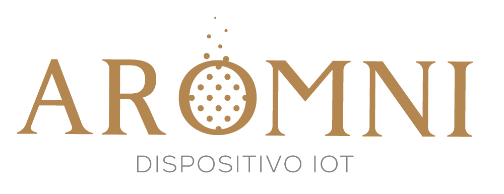
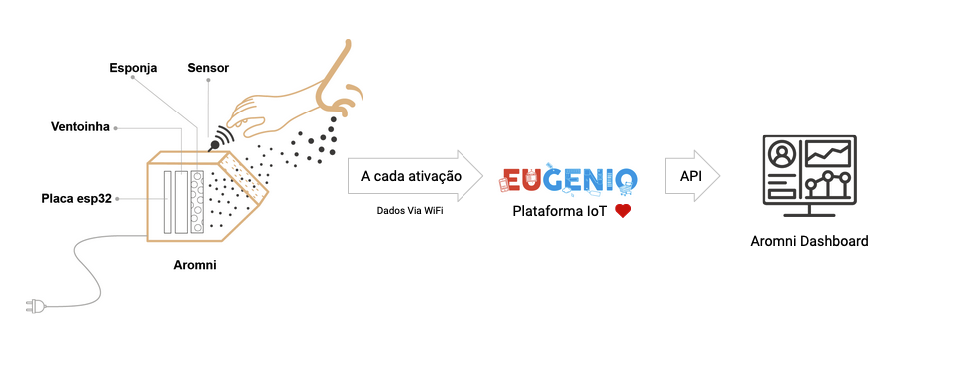
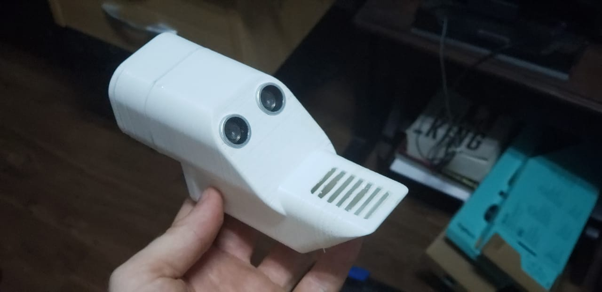
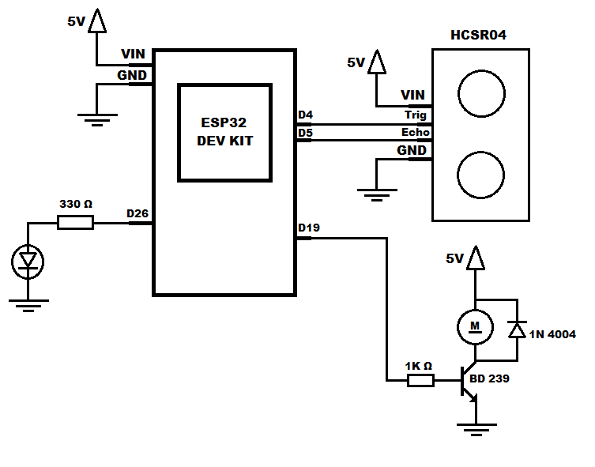

[![MIT License][license-shield]][license-url]
[![LinkedIn][linkedin-shield]][linkedin-url]

 

  

  <h3 align="center">Eugenio Challenge Hub (Natura) - #TIME 15</h3>

  

    O Aromni é um dispositivo IoT que exala aromas através de um sensor de proximidade, dessa forma, livre de contatos diretos com superfícies públicas. Como uma torneira automática, basta aproximar a mão no Aromni, que ele irá exalar a essência, promovendo uma experiência olfativa no cliente.
      
    
      
    
       
 
## Instruções

* Instale a IDE Arduino: [https://www.arduino.cc/en/Main/Software](https://www.arduino.cc/en/Main/Software) 
* Na IDE Arduino vá em Files->Preferences e adicione em "Additional Boards Manager URLs:" a biblioteca da espressif "https://dl.espressif.com/dl/package_esp32_index.json" e clique em OK  
* Após a instalação, vá em Tools->Boards: e selecione a opção "ESP32 Dev Module" 
* Vá em Tools->Manage Libraries... e instale as seguintes bibliotecas: 
    
    * Brisoft library for HC-SR04
    * PubSubClient - Nick O´Leary
* No arquivo secrets.h substitua os defines de SSID e PASSWORD com os dados da sua rede WiFi e também o define de DEVICE_ID e as variáveis "cacert", "client_cert" e "privkey" seguindo os passos da documentação da plataforma Eugenio [https://docs.stg.eugenio.io/information/devices/deviceConnection]

  

## Circuíto

   

## Outros

<b>Linguagem:</b> C++ 
 
## License

Distribuído sob a licença MIT. Veja `LICENSE` para mais informações.

 

## Time

<a href="https://github.com/geneuto/">@Francisco Geneuto - Desenvolvedor</a> 
<a href="https://github.com/denisAlberto/">@Denis Alberto - Desenvolvedor IOT</a> 
<a href="https://www.linkedin.com/in/luckmattos/">@Lucas Mattos - Ux Design</a> 
<a href="https://www.linkedin.com/in/sergiosilva-business/">@Sérgio Silva - Business</a> 
<a href="https://eueomundo.com/">@Felipe Rafael - Comunicação</a>

Dashboard Project Link: [https://github.com/geneuto/aromni](https://github.com/geneuto/aromni) 
Hardware Project Link: [https://github.com/denisAlberto/Aromni](https://github.com/denisAlberto/Aromni)

[license-shield]: https://img.shields.io/github/license/othneildrew/Best-README-Template.svg?style=flat-square
[license-url]: https://github.com/geneuto/aromni/LICENSE.txt
[linkedin-shield]: https://img.shields.io/badge/-LinkedIn-black.svg?style=flat-square&logo=linkedin&colorB=555
[linkedin-url]: https://www.linkedin.com/in/denis-alberto-silverio-11014925/
[product-screenshot]: template/scren_aromni01.png
